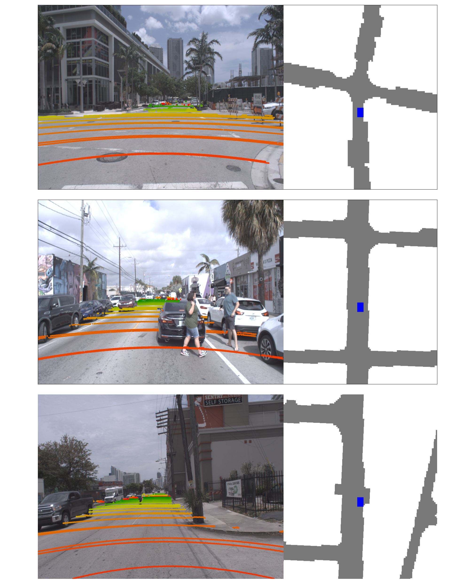
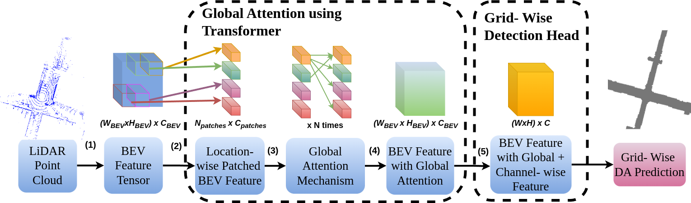
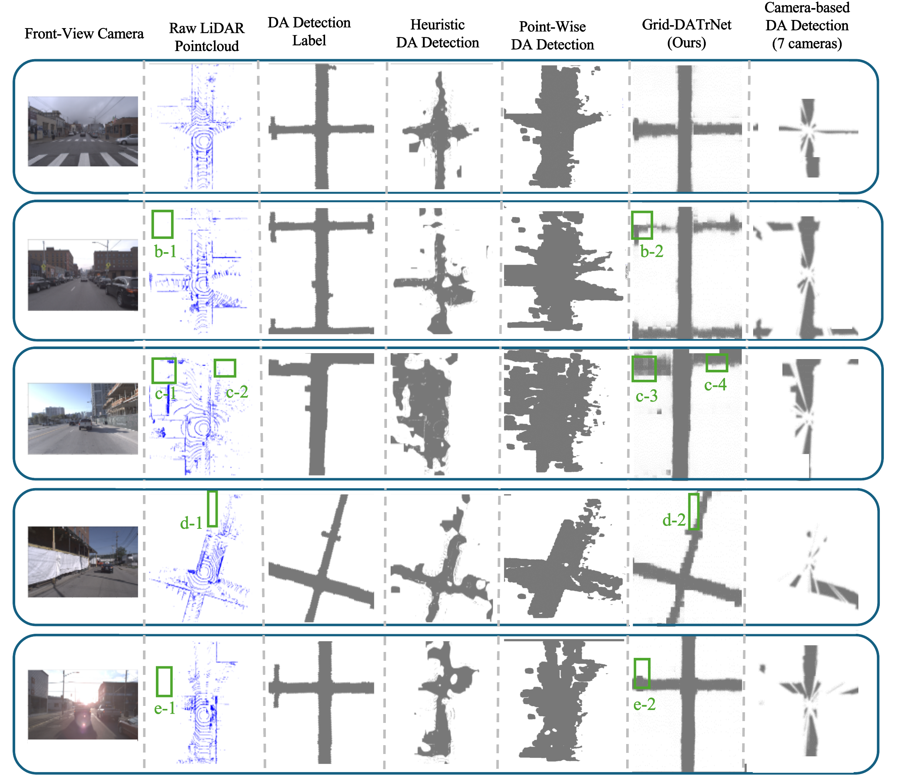

# Grid-Wise Drivable Area (DA) Detection using LiDAR

`Grid-Wise DA Repository` (provided by [`AVELab`](http://ave.kaist.ac.kr/)) is the open LiDAR Drivable Area (DA) detection frameworks that provides a open-source big-scale dataset with wide range of driving scenarios in an urban environment. This tools also provide Drivable Area Detection using LiDAR called **Grid-DATrNet** first grid-wise DA deection using LiDAR leveraging attention mechanism through Transformer.

See our explanation and analysis of grid-wise DA detection on publication : [`See the Unseen : Grid-Wise Drivable Area Detection using LiDAR Dataset and Network`]( https://www.mdpi.com/2072-4292/16/20/3777 ) in Remote Sensing Journal 2024.


# Experiment Requirements

We experiment grid-wise DA detection using system as below :
- **Operating System Linux 20.4**
- **Python 3.8**
- **Torch 2.0**
- **CUDA 11.7**
- **GPU NVIDA RTX3700**

# Preparing Argoverse-grid Dataset

First We proposed open-source big-scale grid-wise DA detection using challenging Dataset Argoverse dataset leveraging HD Map provided in Argoverse dataset. Hence first download the official Argoverse 1 dataset and HD Map information from [`official Argoverse 1 Dataset download`](https://www.argoverse.org/av1.html).

Then order the Argoverse 1 Dataset with file order as below.

```
tracking_train1_v1.1
      ├── argoverse-tracking
            ├── train1
                  ├── 0ef28d5c-ae34-370b-99e7-6709e1c4b929
                        ├── [All LiDAR sensor information of scene  0ef28d5c-ae34-370b-99e7-6709e1c4b929]
                  ├── 2bc6a872-9979-3493-82eb-fb55407473c9
                        ├── [ All LiDAR Sensor information of scene 2bc6a872-9979-3493-82eb-fb55407473c9]
                  
                  .....
                  
                  
``` 

**There will be total 65 scenes folder for Argoverse 1 Dataset training**

Then please set up the Argoverse 1 HD Map folder as below.

```
hdmaps
      ├── map_files
            ├── MIA_10316_driveable_area_mat_2019_05_28.npy
            ├── MIA_10316_ground_height_mat_2019_05_28.npy
            ...

```

Visualization of converting Argoverse 1 Dataset into Argoverse-grid can be seen as below.

<p align="center">
  
</p>

# Experiment Installation
Then please install modified Argoverse 1 API in the repository and install needed package for experiment Grid-Wise DA Detection as below.

1. First install modified Argoverse 1 API using command as below.

```
cd argoverse-api/
pip install -e .
```

2. Then install needed package for experiment Grid-Wise DA detection using LiDAR with running command as below.

```
cd ..
pip install -r requirements.txt
```

# Experiment using Grid-DATrNet
We proposed novel grid-wise DA detection using attention mechanism through Transformer **Grid-DATrNet**. Architecture of grid-wise DA detection using attention mechanism can be seen as below.

<p align="center">
  
</p>


Then We can experiment training using proposed Grid-DATrNet by set up the configs file and run the command as below.

1.Set up the dataset training path in config file. Change value `dataset_path` and `dataset_path_val` in line 130 and 131 in config file `/configs/Grid-DATrNet_using_Global_Attention.py` based on the Argoverse 1 training dataset path.

2.Then running the training python script using command as below.

```
sudo python train_gpu_0.py
```

# Making DA Detection using Grid-DATrNet
For predicting DA Detection using Grid-DATrNet you can change the path of Grid-DATrNet model in variable `path_ckpt` in file ***validate_gpu_0.py*** based on your Grid-DATrNet model checkpoints and run testing python script using command as below.

```
sudo python validate_gpu_0.py
```

**If you want to visualize DA detection result you can change value of setting `is_visualized_result` and `is_save_visualization` to ***True*** in configs file of Grid-DATrNet**

Visualization of result proposed Grid-DATrNet on proposed Argoverse-Grid dataset can be seen as below.




## Model Zoo
|Name|Accuracy|F1 Score|GFLOPs|Model|Paper|
|:---:|:---:|:---:|---:|:---:|:---:|
|Grid-DATrNet (PointPillar + Global Attention)|93.40|0.8321|180|<a href="https://drive.google.com/drive/folders/14QHSxbCsUEf0FYZIa3j_uMFcLmMDwQmB?usp=sharing">Link</a>|<a href="https://www.preprints.org/manuscript/202409.1668/v1 ">Link</a>|
|Grid-DATrNet (PointPillar + MLP Mixer)|91.40|0.8145|110|<a href="https://drive.google.com/drive/folders/14QHSxbCsUEf0FYZIa3j_uMFcLmMDwQmB?usp=sharing">Link</a>|<a href="https://arxiv.org/abs/2210.08745">Link</a>|

## License
`Grid-Wise DA` is released under the Apache-2.0 license.

## Acknowledgement
The Grid-Wise DA benchmark is contributed by [Christofel Rio Goenawan](https://ave.kaist.ac.kr/bbs/board.php?bo_table=sub1_2&wr_id=27) and [Dong-Hee Paek](http://ave.kaist.ac.kr/bbs/board.php?bo_table=sub1_2&wr_id=5), advised by [Seung-Hyun Kong](http://ave.kaist.ac.kr/bbs/board.php?bo_table=sub1_1).

We thank the maintainers of the following projects that enable us to develop `Grid-Wise DA`:
[`OpenPCDet`](https://github.com/open-mmlab/OpenPCDet) by MMLAB, [`TuRoad`](https://github.com/Turoad/lanedet) bu TuZheng.
[`K-Lane`](https://github.com/kaist-avelab/K-Lane) by Dong-Hee.

This work was supported by the National Research Foundation of Korea (NRF) grant funded by the Korea government (MSIT) (No. 2021R1A2C3008370).

## Citation

If you find this work is useful for your research, please consider citing:
```
@article{goenawan2024see,
  title={See the Unseen: Grid-Wise Drivable Area Detection Dataset and Network Using LiDAR},
  author={Goenawan, Christofel Rio and Paek, Dong-Hee and Kong, Seung-Hyun},
  journal={Remote Sensing},
  volume={16},
  number={20},
  pages={3777},
  year={2024},
  doi={10.3390/rs16203777}
}
```
